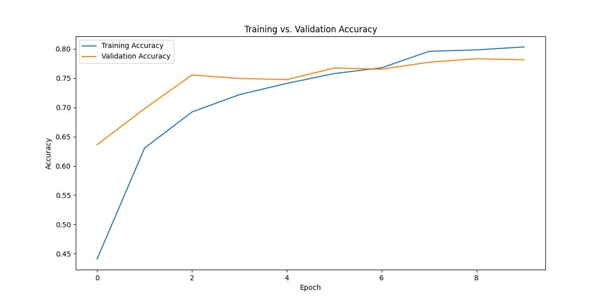
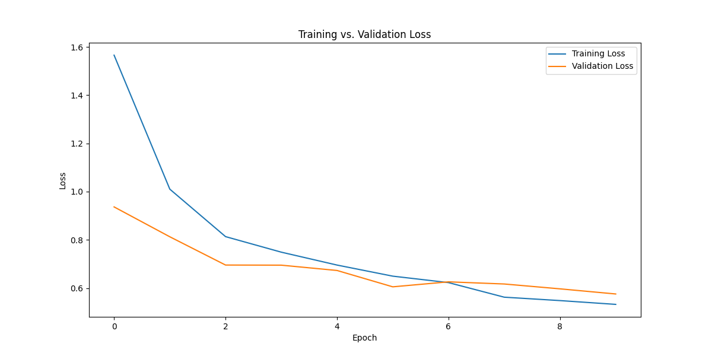
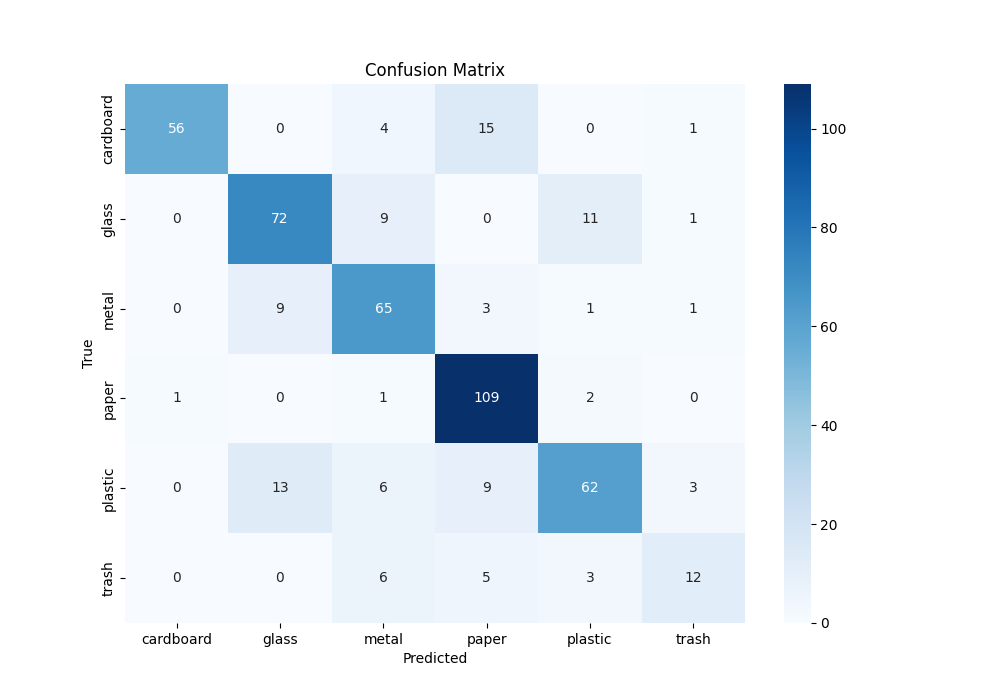

# AI Waste Classifier Project

This is a project done using [Python](https://www.python.org/) that will categorize images of certain wastes into the following categories:

- Metal
- Paper
- Plastic
- Glass
- Cardboard
- Regular trash

This project uses the [TrashNet](https://github.com/garythung/trashnet) Dataset to train the CNN model into categorizing these types of substances.

## How to train the model

You first need to install the following dependencies:

- TensorFlow
- OpenCV
- NumPy
- Pandas
- MatPlotLib
- Seaborn
- Streamlit

You can use this command to install the required dependencies:

```
pip install tensorflow opencv-python scikit-learn numpy pandas matplotlib seaborn streamlit
```

Afterwards, you can now run the "train_model.py" file to create the model:

```
python train_model.py
```

## How to use the model

This repo includes a simple StreamLit client that will ask you to upload images and use the generated model ("waste_classifier_mobilenet.h5") to try and categorize them as best as it can. For your convience, an already generated model is included in the repository, that way you don't need to run the "train_model.py" script.

Below are some of the graphs of the results from the training model:





To run this program, use this command:

```
streamlit run app.py
```